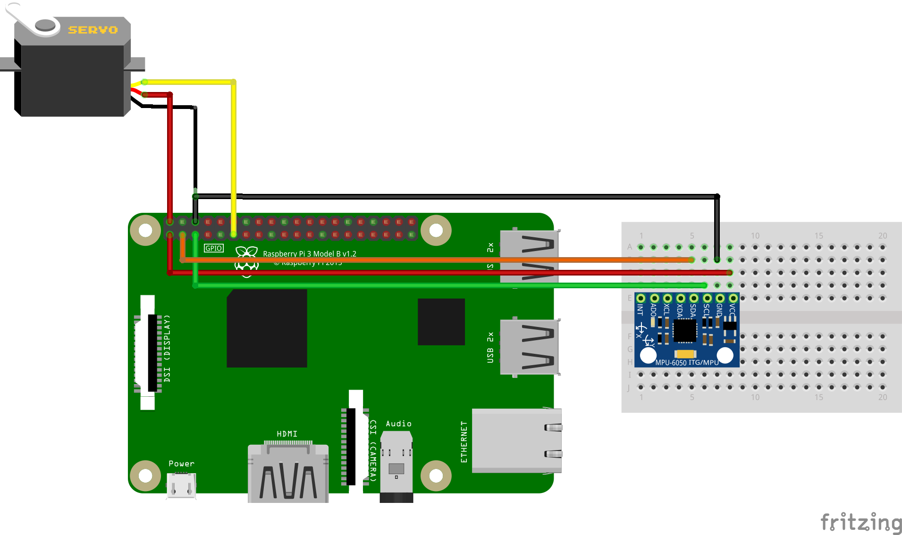

# Gesture control 
## Installation
`git clone --recurse-submodules https://github.com/AlaaRoshdy/Gesture_control.git` 
or using ssh:

`git clone --recurse-submodules git@github.com:AlaaRoshdy/Gesture_control.git`
## Introduction
In this project, we implement gesture control using MPU6050. Essentially, we sync the rotation of the IMU with the rotation of the servo motor. The rotation of the IMU in the x-direction clockwise causes the servo to rotate clockwise as well. If it's rotating anticlockwise, the servo rotates anticlockwise as well. The stop condition for the servo is when the IMU rotates more than 45 degrees in the y-direction. 
## Methodology
For the IMU readings, we use a python library of Kalman filter to filter the raw data. The values gotten from the IMU gets filtered using get_angles() function which implements kalman filter. A condition is then added on the returned value of the x-axis angle. This condition ensures that the value is never greater than 180 nor less than 0. Thus, any value greater than 180 would be considered (0 + this value). This value gets fed to the IMU to rotate to. The initial position of the IMU is 90 degrees, which gives it 90 degrees clockwise and anticlockwise to freely rotate in. An if condition is added to ensure that the IMU is allowed to rotate as long as the y-axis angle is less than 45 degrees.
## Schematic

## Results
The hardware behaves as expected, resulting in very accurate mapping from IMU movement to servo rotation. The link below shows the hardware tested.
https://drive.google.com/a/zewailcity.edu.eg/file/d/1D_V2eAOKS7bQqiBz33VP6gknDJP4I7ag/view?usp=drivesdk

